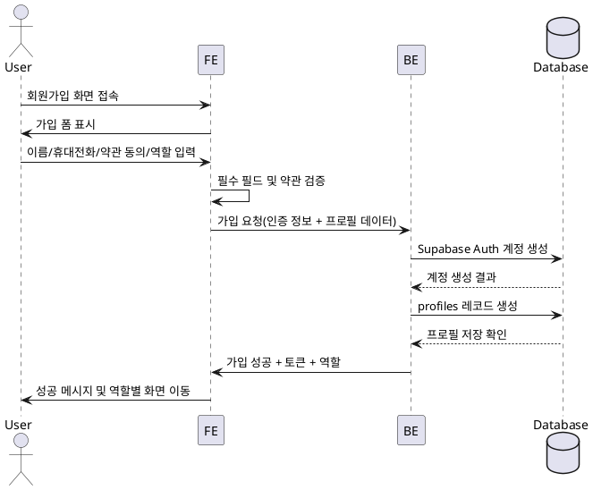

# Use Case 001 - 가입 선택 & 정보 입력

## Use Case Card
- **Primary Actor**: 신규 가입 사용자 (Learner 또는 Instructor)
- **Precondition**: 사용자가 가입 화면에 접근했으며 이름, 휴대전화, 약관 동의 여부를 확인할 준비가 되어 있다.
- **Trigger**: 사용자가 회원가입 폼에서 역할을 선택하고 필수 정보를 입력한 뒤 가입 버튼을 누른다.

## Main Scenario
1. FE는 가입 폼을 렌더링하여 이름, 휴대전화, 약관 동의 체크박스, 역할 선택, 이메일/비밀번호 입력을 요청한다.
2. User는 필수 입력값을 채우고 약관에 동의하며 역할(Learner 또는 Instructor)을 선택한다.
3. FE는 입력값을 검증해 필수 필드와 약관 동의 여부를 확인하고 Supabase Auth 가입 요청을 BE API로 전달한다.
4. BE는 Supabase Auth에 계정을 생성하고 성공 응답을 받는다.
5. BE는 `profiles` 테이블에 신규 사용자 프로필과 역할, 휴대전화, 이름을 저장한다.
6. BE는 기본 권한 토큰을 발급해 FE로 반환한다.
7. FE는 사용자 역할에 따라 Learner 카탈로그 또는 Instructor 대시보드로 리다이렉션한다.

## Edge Cases
- **중복 이메일**: Supabase Auth가 중복 계정 오류를 반환하면 FE는 사용자에게 이미 가입된 이메일임을 안내하고 재입력을 요청한다.
- **약관 미동의**: 약관에 동의하지 않으면 FE가 가입 요청을 차단하고 동의 필요 메시지를 표시한다.
- **약한 비밀번호**: 비밀번호 정책을 충족하지 못하면 BE가 오류를 전파하고 FE는 규칙을 안내한다.
- **네트워크 실패**: Auth 또는 프로필 저장 단계에서 실패 시 재시도 옵션과 고객센터 안내를 표시한다.

## Business Rules
- 역할은 `learner` 또는 `instructor` 중 하나여야 한다.
- 이름, 휴대전화, 역할, 약관 동의(checked true)는 필수 항목이다.
- 프로필 생성은 Auth 계정 생성이 성공한 경우에만 진행된다.
- 기본 권한 토큰은 역할별 초기 화면 접근 범위를 포함해야 한다.

## Sequence Diagram

