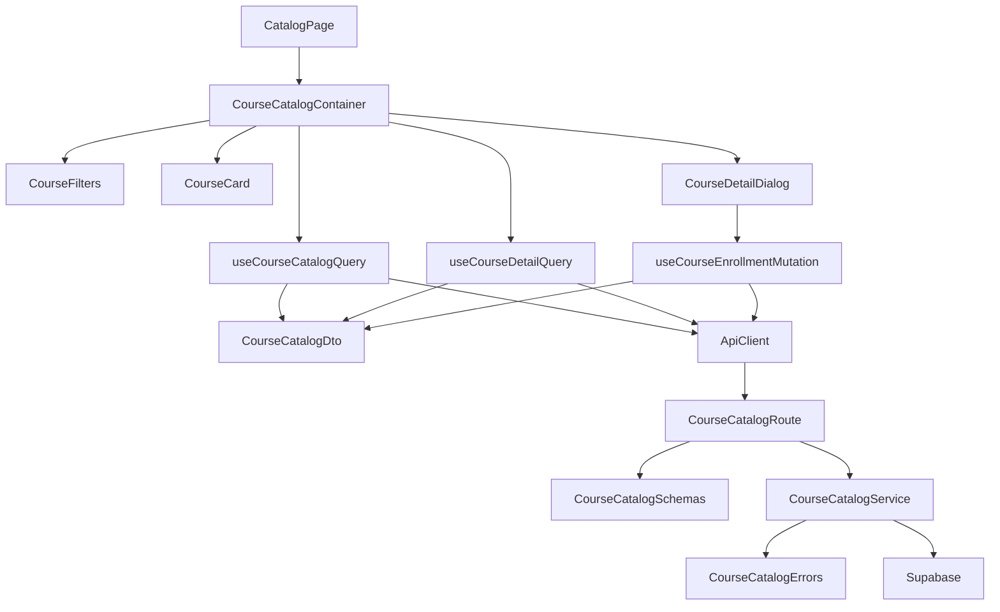

## Overview
- **CourseCatalogSchemas** (`src/features/course-catalog/backend/schema.ts`): 코스 목록/상세/수강신청 요청·응답을 정의하는 zod 스키마와 파라미터 정리.
- **CourseCatalogErrors** (`src/features/course-catalog/backend/error.ts`): 서비스/라우트에서 재사용할 오류 코드와 메시지 맵.
- **CourseCatalogService** (`src/features/course-catalog/backend/service.ts`): Supabase 질의로 목록/상세 조회 및 중복 방지 수강신청을 처리하는 비즈니스 로직.
- **CourseCatalogRoute** (`src/features/course-catalog/backend/route.ts`): Hono 라우터에서 목록/상세/수강신청 엔드포인트를 노출하고 스키마 검증 및 실패 응답을 매핑.
- **CourseCatalogDto** (`src/features/course-catalog/lib/dto.ts`): 프런트엔드에서 재사용할 스키마 및 타입 재노출.
- **CourseCatalogConstants** (`src/features/course-catalog/constants/filters.ts`): 정렬/카테고리/난이도 옵션과 기본값을 정의.
- **useCourseCatalogQuery** (`src/features/course-catalog/hooks/useCourseCatalogQuery.ts`): 검색/필터 조건을 전달해 목록을 가져오는 React Query 훅.
- **useCourseDetailQuery** (`src/features/course-catalog/hooks/useCourseDetailQuery.ts`): 코스 상세와 수강 여부를 가져오는 React Query 훅.
- **useCourseEnrollmentMutation** (`src/features/course-catalog/hooks/useCourseEnrollmentMutation.ts`): 수강신청 API를 호출하고 성공/오류 상태를 표준화.
- **CourseFilters** (`src/features/course-catalog/components/course-filters.tsx`): 검색어/필터 입력 UI, shadcn 컴포넌트를 활용.
- **CourseCard** (`src/features/course-catalog/components/course-card.tsx`): 코스 정보를 카드 형태로 렌더링하고 placeholder 이미지를 picsum.photos로 제공.
- **CourseCatalogContainer** (`src/features/course-catalog/components/course-catalog-container.tsx`): 필터, 목록, 상세 다이얼로그를 조합하고 훅을 orchestration.
- **CourseDetailDialog** (`src/features/course-catalog/components/course-detail-dialog.tsx`): 상세 정보를 표시하고 수강신청 버튼을 제공하는 모달 컴포넌트.
- **CatalogPage** (`src/app/(protected)/catalog/page.tsx`): Learner 전용 코스 카탈로그 페이지, 상위 레이아웃과 연결.
- **DashboardShortcut** (`src/app/(protected)/dashboard/page.tsx`): 대시보드에서 카탈로그로 진입할 CTA 카드 추가.
- **HonoAppRegistration** (`src/backend/hono/app.ts`): CourseCatalog 라우트 등록을 위한 라우터 연결.

## Diagram

## Implementation Plan
### Backend
#### CourseCatalogSchemas (`src/features/course-catalog/backend/schema.ts`)
- 목록 필터(검색어, 카테고리, 난이도, 정렬)와 페이지네이션 기본값을 zod로 정의.
- 코스 요약/상세/수강상태 응답 스키마를 명시하고 ISO 날짜·금액 등 타입 보정.
- Enrollment 요청 본문에 learnerId 없이 처리할 수 있도록 세션 기반 userId 필드를 optional + route에서 주입 구조 마련.

#### CourseCatalogErrors (`src/features/course-catalog/backend/error.ts`)
- `invalidFilter`, `courseNotFound`, `alreadyEnrolled`, `courseNotPublished`, `supabaseError` 등 오류 코드/메시지 매핑.
- HTTP 상태 코드 대응 테이블을 제공해 route에서 재사용.

#### CourseCatalogService (`src/features/course-catalog/backend/service.ts`)
- Supabase from `courses`, `course_categories`, `enrollments` 테이블을 사용해 필터링 구현; 중복 수강 검사와 `published` 상태 검증 포함.
- Learner 권한 확인을 위해 `profiles` 테이블에서 `role` 조회 함수 추가.
- 성공/실패 응답을 `success`/`failure` 헬퍼로 반환.
- **Unit Tests**: `vitest` 기반으로 Supabase 클라이언트 mock 후
  - 필터 조합에 따른 목록 쿼리 파라미터 검증
  - 이미 수강 중인 경우 `alreadyEnrolled` 반환 확인
  - 미공개 코스 요청 시 `courseNotPublished` 반환 확인
  - Supabase 오류 전달 시 500 코드 유지 검증
  - Learner 외 역할일 때 권한 오류 반환 확인

#### CourseCatalogRoute (`src/features/course-catalog/backend/route.ts`)
- `GET /catalog/courses`(목록), `GET /catalog/courses/:id`(상세+수강여부), `POST /catalog/courses/:id/enroll`(수강신청) 라우트 정의.
- 요청 파라미터와 본문을 스키마로 검증 후 서비스 호출. 오류 코드는 `CourseCatalogErrors` 매핑으로 응답.
- `getSupabase`, `getLogger`를 활용하고 AppEnv 타입 준수.

#### CourseCatalogDto (`src/features/course-catalog/lib/dto.ts`)
- 백엔드 스키마의 타입/상수를 export해 훅과 컴포넌트에서 재사용.

#### HonoAppRegistration (`src/backend/hono/app.ts`)
- `registerCourseCatalogRoutes` 함수 호출을 추가해 API 엔드포인트 노출.

### Frontend Hooks & State
#### CourseCatalogConstants (`src/features/course-catalog/constants/filters.ts`)
- 카테고리/난이도/정렬 옵션 배열과 기본값, React Query 키 빌더를 상수화.

#### useCourseCatalogQuery (`src/features/course-catalog/hooks/useCourseCatalogQuery.ts`)
- `useQuery`로 목록 가져오기, 필터 객체 직렬화 유틸 포함.
- 실패 시 `extractApiErrorMessage`로 message 추출.

#### useCourseDetailQuery (`src/features/course-catalog/hooks/useCourseDetailQuery.ts`)
- 코스 ID 기반 상세 정보 요청, `enabled` 조건과 stale time 조정.

#### useCourseEnrollmentMutation (`src/features/course-catalog/hooks/useCourseEnrollmentMutation.ts`)
- `useMutation`으로 POST 호출, 성공 시 목록/상세 query invalidate.
- 409/403/500 등 상태별 메시지 매핑을 반환.

### Presentation Components
#### CourseFilters (`src/features/course-catalog/components/course-filters.tsx`)
- `"use client"` 선언, `react-hook-form`으로 검색/필터 상태 제어.
- shadcn `Input`, `Select`, `Button`, `Badge` 조합, `lucide-react` 아이콘 사용.
- **QA Sheet**:
  - 검색어 입력 후 엔터 시 목록이 갱신되는지 확인.
  - 필터 초기화 버튼 클릭 시 기본 목록으로 복원되는지 검증.
  - 잘못된 조합(빈 문자열 등)이 있을 때 기본값으로 대체되는지 확인.

#### CourseCard (`src/features/course-catalog/components/course-card.tsx`)
- 코스 요약 정보, 난이도/카테고리 태그, `picsum.photos/seed` 기반 placeholder 이미지 노출.
- 클릭 시 상세 다이얼로그를 여는 콜백 전달.
- **QA Sheet**:
  - 이미지 로드 실패 시 Next Image fallback alt 텍스트 확인.
  - 이미 수강 중인 코스에는 배지 또는 disable 상태 표시.
  - 카드 클릭 시 상세 다이얼로그가 올바른 코스 정보를 받는지 확인.

#### CourseDetailDialog (`src/features/course-catalog/components/course-detail-dialog.tsx`)
- shadcn `Dialog` 구성, 상세 데이터 렌더링 및 수강신청 버튼 제공.
- 상태에 따라 로딩/성공/에러 토스트를 표시하고 disable 처리.
- **QA Sheet**:
  - 수강신청 성공 시 토스트와 버튼 상태 변경 확인.
  - 409, 403, 500 응답별 메시지가 올바르게 표출되는지 검증.
  - Detail fetch 실패 시 다이얼로그 내 오류 메시지/재시도 UI 확인.

#### CourseCatalogContainer (`src/features/course-catalog/components/course-catalog-container.tsx`)
- 필터 폼 상태를 훅과 연결하고 목록+상세 다이얼로그를 조정.
- Learner가 아닌 경우 접근 제어 메시지 출력.
- **QA Sheet**:
  - Learner가 아닐 때 안내 메시지가 노출되고 API 호출이 차단되는지 확인.
  - 목록 로딩/빈 상태/에러 상태 UI가 요구사항과 일치하는지 검증.
  - 수강신청 완료 후 목록에서 상태가 즉시 갱신되는지 확인.

### Pages & Navigation
#### CatalogPage (`src/app/(protected)/catalog/page.tsx`)
- `"use client"` 선언, `params`를 `Promise` 타입으로 유지.
- `CourseCatalogContainer`를 포함하고 Headline/서브카피 정의.
- Learner 여부 확인을 위해 `useCurrentUser` 사용.
- **QA Sheet**:
  - 페이지 진입 시 필수 데이터를 fetch하고 빈 상태일 때 안내 메시지가 노출되는지 확인.
  - 로그인하지 않은 경우 리디렉션 또는 안내가 정상 동작하는지 검증.
  - 모바일/데스크톱에서 레이아웃 responsive 동작 확인.

#### DashboardShortcut (`src/app/(protected)/dashboard/page.tsx`)
- 기존 카드 레이아웃에 "코스 카탈로그 이동" CTA 카드 추가.
- `next/link`로 `/catalog` 연결, Learner 전용 copy 제공.
- **QA Sheet**:
  - CTA 클릭 시 카탈로그 페이지로 이동하는지 확인.
  - 카드가 Learner 외 역할에서 숨김 처리되는지 검증.

### Integration & Support
- React Query Provider가 이미 존재하는지 확인 후 필요한 query key constants를 공유.
- Toast/에러 메시지 국제화 포맷을 기존 스타일과 맞춤.
- Supabase 쿼리에 필요한 인덱스가 없을 경우 핵심 칼럼(`status`, `category_id`, `level`, `title`)에 대한 인덱스 필요 여부 문서화.
- API 경로를 Next.js route 핸들러(`/api/[[...hono]]`)로 프록시하는 기존 구조를 재사용.
