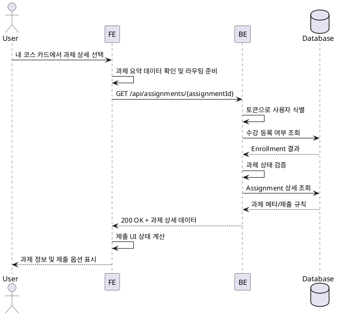

# 과제 상세 열람 (Learner)

## Primary Actor
- 코스에 등록된 Learner

## Precondition (사용자 관점)
- 사용자는 유효한 계정으로 로그인되어 있다.
- 사용자는 해당 코스에 이미 수강 신청을 완료했다.
- 사용자는 대시보드의 "내 코스" 섹션에서 과제 빠른 액션이 노출된 코스 카드를 확인할 수 있다.
- 대시보드 데이터가 최신 상태로 동기화되어 있다.

## Trigger
- 사용자가 "내 코스" 카드 내 과제 빠른 액션에서 특정 과제 상세 보기를 선택한다.

## Main Scenario
1. 사용자가 대시보드 "내 코스" 섹션에서 학습 중인 코스 카드를 펼친다.
2. FE는 카드에 연결된 과제 요약 데이터를 기반으로 선택 가능한 과제 목록을 노출한다.
3. 사용자가 과제 상세 보기를 클릭하면 FE는 과제 식별자(`assignmentId`)를 확보하고 라우터를 통해 과제 상세 페이지로 이동하며 React Query로 `GET /api/assignments/{assignmentId}` 요청을 발행한다.
4. BE는 액세스 토큰으로 사용자를 식별하고 해당 코스 수강 등록 여부를 검증한다.
5. BE는 과제 상태가 `published`인지 확인한 뒤 상세 데이터를 조회한다.
6. Database는 과제 메타 정보, 제출 규칙, 마감 정보를 반환한다.
7. BE는 검증 결과와 함께 과제 상세 데이터를 FE로 응답한다.
8. FE는 응답을 기반으로 과제 제목, 마감일, 배점, 제출 규칙, 제출 UI 상태를 렌더링한다.
9. FE는 과제 상태와 사용자 제출 이력에 따라 제출 버튼 활성화 여부와 안내 메시지를 갱신한다.

## Edge Cases
- 코스 카드에 노출할 과제가 없는 경우: FE는 "과제가 없습니다" 메시지를 표시하고 상세 진입 버튼을 비활성화한다.
- 사용자가 해당 코스에 등록되어 있지 않음: BE는 403을 반환하고 FE는 접근 불가 메시지를 표시한다.
- 과제가 `published` 상태가 아님: BE는 404를 반환하고 FE는 과제 정보를 숨기고 대시보드 목록으로 복귀 옵션을 제공한다.
- 과제가 `closed` 상태임: FE는 제출 UI를 비활성화하고 마감 안내를 노출한다.
- 대시보드 카드 데이터가 만료됨: FE는 과제 요약 데이터를 React Query로 재검증해 최신 상태로 갱신한다.
- 네트워크 또는 서버 오류 발생: FE는 에러 토스트를 띄우고 재시도 액션을 제공한다.

## Business Rules
- "내 코스" 카드는 사용자 수강 등록이 확인된 `published` 과제만 빠른 액션으로 노출한다.
- 과제 상세 정보는 `published` 상태의 과제에만 노출된다.
- 제출 UI 활성화는 사용자 수강 등록 상태와 과제 상태(`opened`, `closed`)에 따라 결정된다.
- 마감일 경과 후에도 지연 제출 허용 플래그가 true면 제출 UI는 유지하되 late 상태를 표시한다.
- 사용자의 기존 제출이 존재하면 최신 제출 상태와 제출 링크를 함께 보여줘야 한다.

