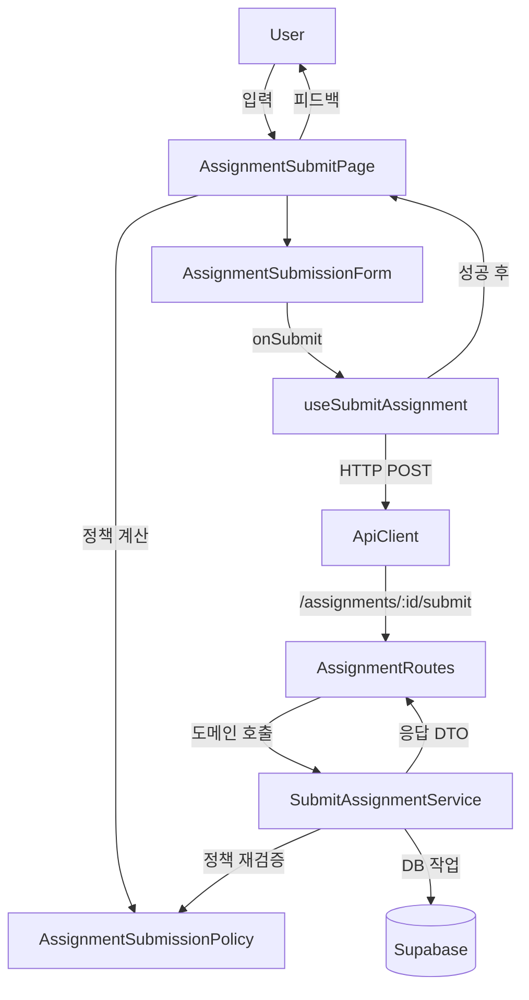

# UC-004 모듈 설계

## 개요
- AssignmentSubmissionPolicy (`src/features/assignments/lib/submission-policy.ts`): 과제 상태, 마감, 정책 정보를 받아 제출 가능 여부와 차단 사유를 계산하는 순수 함수 모음.
- SubmitAssignmentService (`src/features/assignments/backend/service.ts`): Supabase 트랜잭션 로직을 정책 모듈과 연동해 제출 레코드 저장을 책임지는 도메인 서비스.
- AssignmentSubmissionForm (`src/features/assignments/components/assignment-submission-form.tsx`): `react-hook-form` 기반 제출 UI로 정책 결과 안내와 입력 검증을 수행하는 프레젠테이션 컴포넌트.
- useSubmitAssignment (`src/features/assignments/hooks/useSubmitAssignment.ts`): 제출 API 호출, 캐시 무효화, 성공 후 후속 처리(리다이렉트, 토스트)를 담당하는 앱 훅.
- AssignmentSubmitPage (`src/app/(protected)/dashboard/courses/[courseId]/assignments/[assignmentId]/submit/page.tsx`): 상세 및 정책 조회, 폼 조립, 사용자 흐름 제어를 수행하는 페이지 컴포넌트.
- AssignmentRoutes (`src/features/assignments/backend/route.ts`): 제출, 조회 라우트에서 정책 기반 검증 실패 시 일관된 에러 페이로드를 내려주는 HTTP 어댑터.

## Diagram

## Implementation Plan
### AssignmentSubmissionPolicy (`src/features/assignments/lib/submission-policy.ts`) - Business Logic
1. 도메인 요구사항을 `evaluateSubmissionEligibility`, `getSubmissionBlockReason` 함수로 추상화하고 입력 DTO 타입을 정의한다.
2. 시간 비교는 `date-fns`를 사용해 UTC와 로컬 간 혼선을 방지한다.
3. 재사용을 위해 FE와 BE 모두 import 가능한 순수 함수로 구성하고 `ts-pattern`으로 상태 분기를 명확히 한다.
- Unit Tests: `src/features/assignments/lib/__tests__/submission-policy.test.ts`에서 정상 제출, 마감/지연, 재제출 차단, 미게시 상태 케이스를 검증한다.

### SubmitAssignmentService (`src/features/assignments/backend/service.ts`) - Business Logic
1. 기존 로직에서 정책 판별 부분을 `AssignmentSubmissionPolicy` 호출로 대체하고 반환 구조를 활용해 early return을 정리한다.
2. Supabase insert 이전에 정책 결과를 다시 확인해 FE 우회 요청도 방어한다.
3. 응답 DTO와 에러 코드는 기존 스키마를 유지하되 정책 결과별 전용 에러 코드를 매핑한다.
- Unit Tests: `src/features/assignments/backend/__tests__/service.submit.test.ts`에서 Supabase 클라이언트를 mock하여 허용, 차단 시나리오별 status code, late 플래그, version 증가를 검증한다.

### AssignmentSubmissionForm (`src/features/assignments/components/assignment-submission-form.tsx`) - Presentation
1. `react-hook-form`과 `zodResolver`로 텍스트, URL 검증을 구성하고 정책 결과에 따라 폼 활성화와 가이드 메시지를 보여준다.
2. 제출 버튼 로딩, late 안내, 재제출 불가 메시지 등 UX 피드백을 컴포넌트 내부에서 처리한다.
3. `lucide-react` 아이콘과 shadcn-ui 컴포넌트로 접근성 있는 UI를 조립한다.
- QA Sheet:
  - [ ] 미게시, 마감 과제는 폼이 비활성화되고 차단 안내가 노출되는가?
  - [ ] 텍스트 미입력, 잘못된 URL 입력 시 인라인 에러가 즉시 표시되는가?
  - [ ] 지연 제출 허용 과제에서 late 안내와 성공 토스트 문구가 정책대로 표출되는가?
  - [ ] 제출 성공 후 1초 내 대시보드로 이동하고 캐시가 갱신되는가?

### useSubmitAssignment (`src/features/assignments/hooks/useSubmitAssignment.ts`) - Application Logic
1. 훅에서 성공 콜백을 인자로 받아 페이지에서 라우팅과 토스트를 주입 가능하게 확장한다.
2. 오류 메시지를 `extractApiErrorMessage`와 `ts-pattern`으로 분류해 late, resubmission 에러를 사용자 친화적으로 변환한다.
3. React Query invalidation 키(`assignment-detail`, `learner-dashboard`)를 상수로 정리해 재사용 가능하게 한다.
- Unit Tests: `src/features/assignments/hooks/__tests__/useSubmitAssignment.test.tsx`에서 React Query 테스트 유틸을 사용해 성공, 실패 시 캐시 무효화와 메시지 매핑을 검증한다.

### AssignmentSubmitPage (`src/app/(protected)/dashboard/courses/[courseId]/assignments/[assignmentId]/submit/page.tsx`) - Presentation
1. `useAssignmentDetail`로 가져온 데이터를 `AssignmentSubmissionPolicy`에 전달해 제출 가능 여부와 안내 메시지를 계산한다.
2. 계산 결과와 URL 파라미터를 `AssignmentSubmissionForm`에 props로 전달하고 성공 시 라우터, 토스트를 콜백으로 연결한다.
3. 로딩, 에러 상태 UI를 shadcn-ui Alert/Button 패턴으로 정리하고 한글 텍스트를 UTF-8로 정돈한다.
- QA Sheet:
  - [ ] 과제 상세 로딩 중 로딩 스피너가 노출되는가?
  - [ ] 권한 오류 시 Alert와 돌아가기 버튼으로 복귀 가능한가?
  - [ ] 정책에 따라 폼 활성화, 비활성화가 정확히 전환되는가?
  - [ ] 제출 성공 시 토스트 후 지정된 경로로 이동하는가?

### AssignmentRoutes (`src/features/assignments/backend/route.ts`) - Interface Layer
1. 제출 라우트에서 정책 차단 시 `failure` 응답 결과를 사용해 HTTP 400 또는 403을 일관되게 반환한다.
2. 스키마 검증 실패 메시지를 한글로 보강하고 로깅이 필요하면 `withAppContext`의 logger를 활용한다.
3. 새로운 에러 코드 매핑 시 `assignmentDetailErrorCodes`를 업데이트하여 FE가 메시지를 매칭할 수 있게 한다.
- Unit Tests: `src/features/assignments/backend/__tests__/route.submit.test.ts`에서 Hono 테스트 클라이언트로 401, 400, 200 흐름을 검증한다.