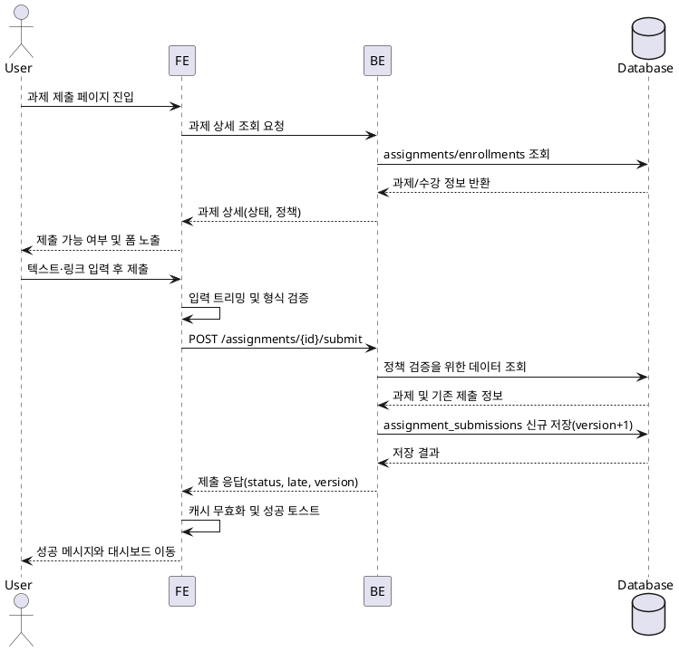

# UC-004 과제 제출 Use Case

- **Primary Actor**: 해당 코스에 등록된 로그인한 Learner
- **Precondition**: Learner가 대시보드에서 과제 제출 페이지를 열었고 과제가 `published` 상태이며 제출 폼 노출이 허용됨
- **Trigger**: Learner가 제출 텍스트와 (선택) 링크를 입력한 뒤 `제출하기` 버튼을 클릭함
- **Main Scenario**:
  1. 페이지 로드시 FE가 과제 상세 API를 호출해 상태(`published`), 마감 시각, 지연 제출 허용 여부, 재제출 허용 정책을 확인한 후 제출 가능 여부를 결정한다.
  2. 제출이 불가하면 FE는 차단 Alert만 노출하고 제출 폼을 숨긴다.
  3. 제출이 가능하면 Learner는 텍스트 응답과 필요 시 URL을 입력한다.
  4. Learner가 `제출하기`를 누르면 FE는 공백을 제거한 텍스트 최소 길이와 URL 형식을 검증한다.
  5. 검증이 통과되면 FE는 공유 API 클라이언트를 통해 `POST /assignments/{assignmentId}/submit` 요청을 전송한다.
  6. BE는 과제 존재, 수강 등록, 과제 상태(미게시/마감 여부), 마감 기한과 지연 정책, 재제출 정책을 순차적으로 검증한다.
  7. 모든 검증이 통과되면 BE는 `assignment_submissions` 테이블에 `status=submitted`, `late` 플래그, `version = 이전 + 1`로 신규 레코드를 저장한다.
  8. BE는 제출 ID, 상태, 지연 여부, 버전 정보를 응답한다.
  9. FE는 지연 여부에 따라 성공 토스트를 보여 주고 `assignment-detail`, `learner-dashboard` 쿼리를 무효화한 뒤 1초 후 `/dashboard`로 리다이렉트한다.
- **Edge Cases**:
  - 과제가 `closed`이거나 미게시 상태: FE가 즉시 폼을 차단하고 BE는 요청 시 400 오류를 반환한다.
  - 마감 초과 & 지연 제출 미허용: FE가 폼을 숨기고 BE는 400 `LATE_SUBMISSION_NOT_ALLOWED`로 거부한다.
  - 재제출 미허용 과제에서 기존 제출이 존재: BE가 400 `RESUBMISSION_NOT_ALLOWED`를 반환하고 FE는 실패 토스트를 노출한다.
  - 텍스트 미입력 또는 잘못된 URL: FE 검증 단계에서 Alert로 안내하고 API 호출을 취소한다.
  - 수강 미등록/권한 부족, 네트워크·DB 오류: BE가 4xx/5xx로 응답하며 FE는 표준 실패 토스트와 재시도를 안내한다.
- **Business Rules**:
  - 제출 텍스트는 트리밍 후 최소 1자 이상이어야 한다.
  - 링크는 선택 입력이며 제공 시 유효한 URL이어야 하고 없으면 null로 저장된다.
  - 마감 이후 제출되면 `late=true`로 저장되며 지연 제출이 허용되지 않으면 요청을 거부한다.
  - 각 제출은 버전이 1씩 증가하는 신규 레코드로 기록되어 히스토리를 유지하고 기본 상태는 `submitted`이다.
  - 성공 응답 후 FE는 React Query 캐시 무효화와 리다이렉트를 통해 대시보드를 최신 상태로 동기화한다.

