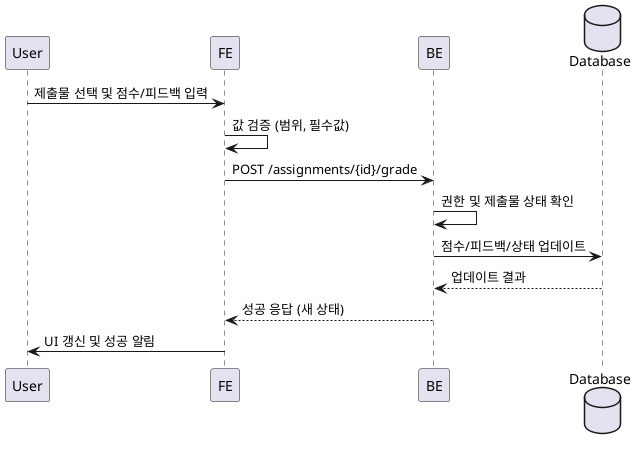

# 과제 채점 및 피드백 상세 유스케이스

## Primary Actor
- Instructor (강사)

## Precondition (사용자관점)
- 강사는 로그인 상태이며 본인 강의의 특정 과제를 열람 중이다.
- 채점 대상 제출물이 목록에서 선택된 상태다.

## Trigger
- 강사가 선택한 제출물에 대해 점수 또는 재제출 요청을 저장하려고 `채점 저장` 액션을 클릭한다.

## Main Scenario
1. 강사는 제출물 상세 패널에서 점수(0~100)와 피드백, 재제출 여부를 입력한다.
2. FE는 입력값을 즉시 검증하고 오류가 없으면 저장 요청을 준비한다.
3. FE는 `@/lib/remote/api-client`를 통해 BE에 채점 저장 API를 호출한다.
4. BE는 강사의 소유권과 제출물 상태를 확인하고, 유효하면 Database에 점수/피드백/재제출 상태를 업데이트한다.
5. BE는 갱신된 상태를 응답으로 반환하고, 필요 시 학습자 알림 흐름을 트리거한다(미도입 시 로깅 처리).
6. FE는 성공 응답을 수신하면 UI를 갱신하고 학습자와 강사에게 상태 변경을 표시한다.

## Edge Cases
- 제출물이 존재하지 않거나 강사의 소유가 아닌 경우 → BE가 404 또는 403을 반환하고 FE는 안내 메시지를 표시한다.
- 점수가 0~100 범위를 벗어난 경우 → FE에서 즉시 차단하고, BE에서도 유효성 에러(422)로 재검증한다.
- 이미 `graded` 상태인데 동시 수정 충돌이 발생한 경우 → BE가 최신 상태로 병합하거나 409를 반환해 FE가 새로고침을 유도한다.
- Database 업데이트 실패 → BE가 500을 반환하고 FE는 재시도 옵션과 고객센터 안내를 제공한다.
- 재제출 요청이 반복적으로 발생한 경우 → BE는 변경된 타임스탬프로 기록하고 FE는 마지막 요청 시각을 노출한다.

## Business Rules
- 점수는 0 이상 100 이하의 정수로 저장한다.
- 재제출 요청 시 제출 상태는 `resubmission_required`로, 점수 없이도 상태 변경만 허용한다.
- 피드백은 최소 5자 이상 작성해야 하며 사전 정의된 Markdown 포맷만 허용한다.
- 채점을 수행하는 강사는 해당 코스에 대한 `instructor` 권한을 보유해야 한다.
- 모든 상태 변경은 타임스탬프와 강사 ID를 함께 기록한다.

