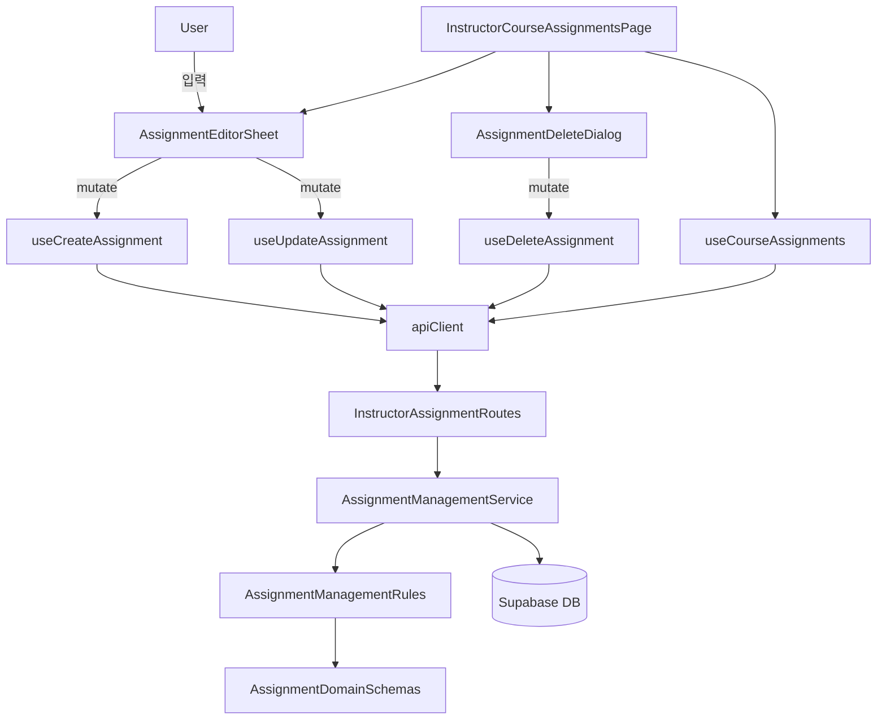

# Assignment 관리 기능 최소 모듈 설계

## 개요
- AssignmentDomainSchemas (`src/features/assignments/backend/schema.ts`, `src/features/instructor/backend/schema.ts`): 생성/수정/삭제 시 필요한 Zod 스키마와 응답 타입을 정의하고 기존 스키마에 누락된 필드(채점 기준, 삭제 여부 등)를 반영.
- AssignmentErrorMap (`src/features/assignments/backend/error.ts`, `src/features/instructor/backend/error.ts`): 상태 전환, 권한, 삭제 제약에 대한 신규 에러 코드를 추가하고 매핑 로직을 확장.
- AssignmentManagementRules (`src/features/assignments/lib/management-rules.ts`): 상태별 수정 가능 필드, 삭제 모드(하드/소프트) 판정, 자동 마감 시각 계산을 담당하는 순수 함수 집합.
- AssignmentManagementService (`src/features/instructor/backend/service.ts`): Supabase 연동 CRUD 로직과 제출 건수 기반 삭제 분기, 상태 전환 로직을 구현.
- InstructorAssignmentRoutes (`src/features/instructor/backend/route.ts`): 생성/수정/상태변경/삭제 HTTP 엔드포인트를 노출하고 공통 권한 체크를 적용.
- AssignmentDTOExports (`src/features/assignments/lib/dto.ts`, `src/features/instructor/lib/dto.ts`): 프런트엔드에서 재사용할 DTO 타입과 스키마를 재노출.
- AssignmentMutationHooks (`src/features/assignments/hooks/useCreateAssignment.ts`, `useUpdateAssignment.ts`, `useDeleteAssignment.ts`): React Query 기반 뮤테이션 훅으로 API 클라이언트를 통해 백엔드 엔드포인트 호출.
- AssignmentEditorSheet (`src/features/assignments/components/assignment-editor-sheet.tsx`): 생성/편집 UI를 제공하는 폼 컴포넌트. Sheet UI를 활용해 동일 뷰에서 작성/수정 가능.
- AssignmentDeleteDialog (`src/features/assignments/components/assignment-delete-dialog.tsx`): 삭제 전 확인 및 소프트 삭제 안내를 제공하는 확인 다이얼로그 컴포넌트.
- InstructorCourseAssignmentsPage (`src/app/(protected)/instructor/courses/[courseId]/assignments/page.tsx`): 신규 폼/다이얼로그를 연결하고 액션 버튼(생성/편집/삭제)을 활성화하는 페이지 레벨 조정.
- SupabaseMigration0005 (`supabase/migrations/0005_assignments_management_extensions.sql`): assignments 테이블에 `grading_rubric`, `auto_close_at`, `is_deleted`, `deleted_at`, `deleted_by` 컬럼과 인덱스를 추가하고 트리거를 보강.

## Diagram

## Implementation Plan

### Backend · Business Logic
#### AssignmentDomainSchemas (`src/features/assignments/backend/schema.ts`, `src/features/instructor/backend/schema.ts`)
- 생성/수정 요청용 `CreateAssignmentRequestSchema`, `UpdateAssignmentRequestSchema`, 상태 변경용 `AssignmentStatusSchema`, 삭제 응답용 `DeleteAssignmentResponseSchema` 추가.
- 기존 상세/요약 스키마에 `gradingRubric`, `isDeleted`, `autoCloseAt` 등을 반영하고 기본값/nullable 범위를 정의.
- `zod` refine을 이용해 마감 기한이 현재 이후인지, 점수 비율이 0~100인지, 허용 옵션 조합이 유효한지 검증.
- Unit Tests: `src/features/assignments/lib/__tests__/assignment-domain-schemas.test.ts`에서 `safeParse` 성공/실패 케이스(마감 과거, 음수 weight 등)를 검증. `vitest` 기반 테스트 러너 추가.

#### AssignmentErrorMap (`src/features/assignments/backend/error.ts`, `src/features/instructor/backend/error.ts`)
- `ASSIGNMENT_ALREADY_DELETED`, `ASSIGNMENT_STATUS_LOCKED`, `ASSIGNMENT_DELETE_FORBIDDEN`, `INVALID_STATUS_TRANSITION` 등 신규 코드 정의.
- `ts-pattern` 분기를 확장해 Postgrest 오류 코드 및 사용자 정의 오류를 새 코드로 매핑.
- Unit Tests: `src/features/assignments/lib/__tests__/assignment-errors.test.ts`에서 가짜 오류 객체를 입력해 기대 코드로 매핑되는지 검증.

#### AssignmentManagementRules (`src/features/assignments/lib/management-rules.ts`)
- `canEditField(status, field)`, `determineDeletionMode(status, submissionStats)`, `calculateAutoCloseAt(dueAt, allowLate)` 등 순수 함수를 정의.
- 상태 전환 허용 여부(`isStatusTransitionAllowed`)와 소프트 삭제 필요 여부를 `ts-pattern`으로 구현.
- Unit Tests: `src/features/assignments/lib/__tests__/management-rules.test.ts`에서 상태별 분기, 자동 마감 계산, 삭제 모드 판정을 검증.

#### AssignmentManagementService (`src/features/instructor/backend/service.ts`)
- Supabase 트랜잭션으로 `createAssignment`, `updateAssignment`, `publishAssignment`, `closeAssignment`, `deleteAssignment` 구현.
- `AssignmentManagementRules`를 활용해 필드 제한, 자동 마감 시각 계산, 삭제 모드 결정, 제출 건수 조회 로직을 구성.
- 기존 조회 계층에서 `is_deleted = false` 조건을 추가하고 `grading_rubric`, `auto_close_at` 값을 Domain DTO로 매핑.
- Unit Tests: `src/features/instructor/backend/__tests__/assignment-management-service.test.ts`에서 Supabase Client를 `vi.fn()`으로 스텁하고 성공/권한 오류/삭제 분기 케이스를 검증.

#### InstructorAssignmentRoutes (`src/features/instructor/backend/route.ts`)
- `POST /instructor/courses/:courseId/assignments`, `PATCH /instructor/assignments/:assignmentId`, `PATCH /instructor/assignments/:assignmentId/status`, `DELETE /instructor/assignments/:assignmentId` 엔드포인트 추가.
- 공통 인증 로직을 함수로 추출하여 중복을 제거하고, 요청 본문을 신규 스키마로 검증 후 서비스에 위임.
- 성공/실패 응답을 `respond` 헬퍼로 표준화하고 403/409 등의 HTTP 상태 코드를 명확히 매핑.
- Unit Tests: 라우트 자체는 Hono 통합 테스트 대신 `service`/`rules` 테스트로 신뢰하고, 최소 smoke 테스트 한 건(`POST` happy path)을 `src/features/instructor/backend/__tests__/assignment-routes.test.ts`에서 Hono `app.request`로 검증.

#### AssignmentDTOExports (`src/features/assignments/lib/dto.ts`, `src/features/instructor/lib/dto.ts`)
- 신규 스키마/타입을 재노출하고, 삭제 여부와 자동 마감 시각 등 클라이언트에서 활용할 필드를 포함.
- React Query 캐시 키 의존성을 문서화하기 위해 주석으로 DTO 변경 사항을 명시.

#### SupabaseMigration0005 (`supabase/migrations/0005_assignments_management_extensions.sql`)
- `grading_rubric TEXT NOT NULL DEFAULT ''`, `auto_close_at TIMESTAMPTZ`, `is_deleted BOOLEAN NOT NULL DEFAULT FALSE`, `deleted_at TIMESTAMPTZ`, `deleted_by UUID` 컬럼 추가.
- `is_deleted` 기본 인덱스 및 `auto_close_at` 보조 인덱스를 생성하고, 기존 `set_updated_at_assignments` 트리거가 신규 컬럼에도 적용되도록 확인.
- 하드 삭제 시 참조 무결성을 유지하도록 `assignment_submissions` 외래키 ON DELETE CASCADE 여부를 재검토.
- Unit Tests: SQL은 직접 테스트 불가하므로 `README` 주석에 수동 검증 절차(SELECT 문) 기록, PR 진행 시 Supabase 콘솔로 확인.

### Frontend · Presentation
#### AssignmentMutationHooks (`src/features/assignments/hooks/useCreateAssignment.ts`, `useUpdateAssignment.ts`, `useDeleteAssignment.ts`)
- `apiClient`를 사용해 신규 엔드포인트 호출, 성공 시 `course-assignments`/`assignment-detail`/`instructor-dashboard` 캐시 무효화.
- `extractApiErrorMessage`로 오류 토스트 메시지를 표준화하고, 409/403에 대한 사용자 친화적 메시지를 설정.
- QA Sheet:
  - [ ] 잘못된 마감일(과거 날짜) 제출 시 클라이언트에서 바로 에러 토스트가 노출된다.
  - [ ] 삭제 성공 후 목록이 즉시 최신 상태로 갱신된다.
  - [ ] 403 응답 시 권한 부족 토스트 메시지가 표시된다.

#### AssignmentEditorSheet (`src/features/assignments/components/assignment-editor-sheet.tsx`)
- `react-hook-form` + `zodResolver`로 폼 상태를 관리하고, `Sheet` 컴포넌트를 사용해 생성/수정 모드를 전환.
- Due date 피커는 `date-fns`를 이용한 포매팅과 minDate 제한을 적용하고, 채점 비중/지연 제출/재제출 토글 UI 포함.
- `lucide-react` 아이콘과 Tailwind 유틸 클래스로 접근성/반응형을 확보.
- QA Sheet:
  - [ ] 신규 과제 생성 시 모든 필드를 채우면 성공 토스트와 함께 시트가 닫힌다.
  - [ ] 마감일을 오늘 이전으로 설정하면 입력 검증 오류가 표시된다.
  - [ ] 기존 과제 편집 시 기존 값이 폼에 프리필되고 변경 사항이 저장된다.
  - [ ] `allowLate` 토글 해제 시 경고 텍스트가 노출된다.

#### AssignmentDeleteDialog (`src/features/assignments/components/assignment-delete-dialog.tsx`)
- `AlertDialog` 혹은 기존 `Sheet`를 활용해 2단계 확인 UI를 제공하고, 소프트 삭제 조건(제출 존재)을 안내.
- 삭제 진행 중 로딩 상태와 에러 메시지를 명확히 표시.
- QA Sheet:
  - [ ] 제출이 없는 초안 과제 삭제 시 “즉시 삭제” 안내와 함께 제거된다.
  - [ ] 제출이 있는 과제 삭제 시 “소프트 삭제” 경고와 함께 목록에서 숨겨진다.
  - [ ] 삭제 취소 시 대화상자가 정상적으로 닫힌다.

#### InstructorCourseAssignmentsPage (`src/app/(protected)/instructor/courses/[courseId]/assignments/page.tsx`)
- 생성 버튼을 활성화하고 `AssignmentEditorSheet`를 호출, 각 카드에 편집/삭제 액션 버튼을 추가.
- React Query 데이터를 사용해 편집 시 최신 데이터를 프리패치하고, 삭제/수정 후 invalidate 로직 추가.
- Learner 접근 차단 로직을 유지하면서 Instructor UX를 개선(빈 상태 안내 업데이트, 토스트 연결).
- QA Sheet:
  - [ ] “새 과제 추가” 버튼 클릭 시 시트가 열리고, 저장 후 목록이 갱신된다.
  - [ ] 각 카드의 “편집” 버튼이 정상적으로 기존 데이터를 불러온다.
  - [ ] 삭제 후 카드가 사라지고, Learner 계정으로 접근 시 여전히 리다이렉트된다.

### Shared & Infrastructure
#### AssignmentDTOExports (Shared)
- 프런트에서 사용할 DTO 타입을 재노출하고, `gradingRubric` 등 새 필드를 명시적으로 optional 처리.
- QA Sheet: 해당 없음 (타입 공유 목적).

#### Tooling: Vitest 세팅
- `vitest`, `@vitest/coverage-v8`, `ts-node` 등을 devDependencies에 추가하고 `vitest.config.ts` 생성.
- `package.json`에 `test` 스크립트 추가, `tsconfig`에 `compilerOptions.types`로 `vitest` 추가.
- QA Sheet: `npm run test` 실행 시 새 테스트들이 통과하는지 확인.
