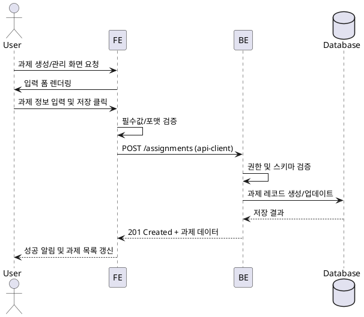
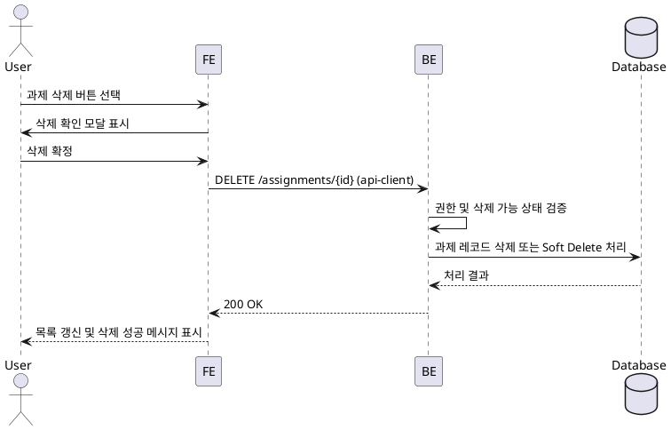

# Assignment 생성/관리 Use Case

## Primary Actor
- Instructor (과제 작성 및 배포 권한 보유자)

## Precondition (사용자 관점)
- Instructor가 유효한 계정으로 로그인되어 있고 담당 강좌 대시보드에 접근한 상태다.
- 관리하려는 강좌에 대한 편집 권한을 가지고 있다.

## Trigger
- Instructor가 과제 생성 또는 기존 과제 편집 버튼을 선택한다.

## Main Scenario
1. Instructor는 과제 생성/관리 페이지에서 제목, 설명, 마감 기한, 지연 제출 허용 여부, 재제출 허용 여부, 채점 기준을 입력한다.
2. FE는 필수 입력값을 검증하고, `@/lib/remote/api-client`를 통해 BE에 과제 생성/업데이트 요청을 보낸다.
3. BE는 Instructor 권한을 확인하고, 요청 본문을 스키마로 검증한 뒤 과제 레코드를 작성하거나 갱신한다.
4. BE는 지연 제출/재제출 옵션에 따른 내부 플래그와 자동 마감 시각(`closed` 전환 스케줄)을 계산하여 Database에 저장한다.
5. Database는 저장 결과를 반환하고, BE는 처리된 과제 데이터를 FE에 응답한다.
6. FE는 응답에 따라 과제 목록을 갱신하고, Instructor에게 성공 알림과 공개 상태(초안/공개/마감)를 보여준다.

## Edge Cases
- 필수 필드 누락 또는 형식 오류: FE 사전 검증 실패 시 사용자에게 오류 표시, BE 단계 오류는 원인 메시지와 함께 재입력 유도.
- 권한 없음: BE가 Instructor 소속을 확인 실패하면 403 응답을 반환하고 FE는 접근 권한 오류를 공지한다.
- 마감 시간이 현재보다 이른 경우: BE가 유효성 검사를 실패 처리하고 FE는 마감 시간을 다시 입력하도록 안내한다.
- 저장 중 네트워크/서버 장애: FE는 재시도 옵션과 임시 저장 경고를 제공하고, BE 장애 시 관리자 알림 로깅을 수행한다.
- 이미 마감된 과제 수정 요청: BE는 상태를 유지한 채 허용 가능한 필드만 갱신하고, 제한된 필드 변경 불가 메시지를 반환한다.

## Business Rules
- 과제는 초안(`draft`) 상태에서만 모든 필드를 수정할 수 있고, 공개(`published`) 후에는 마감 관련 기본 필드만 제한적으로 변경 가능하다.
- 마감 기한은 공개 시각 이후여야 하며, 자동 마감 스케줄에 의해 기한이 지나면 상태가 `closed`로 전환된다.
- 지연 제출 허용 시, 마감 이후 제출은 `late=true`로 기록되며 채점 시 별도 표시된다.
- 재제출 허용이 비활성화된 과제는 학습자당 한 번만 제출할 수 있다.
- Instructor는 자신이 담당한 강좌의 과제만 생성/수정/삭제할 수 있다.
- 삭제된 과제는 즉시 학습자 목록에서 제거되며, 관련 제출 데이터는 보관 규칙에 따라 보존 또는 함께 삭제된다.
- 삭제가 허용되지 않는 상태(`graded` 등)일 경우, 관리자 권한 또는 별도 승인 절차가 필요하다.

## Sequence Diagram

## Assignment 삭제 Use Case

### Primary Actor
- Instructor (과제 삭제 권한 보유자)

### Precondition (사용자 관점)
- Instructor가 로그인되어 있고 삭제 대상 과제가 속한 강좌 편집 권한을 갖고 있다.
- 삭제하려는 과제가 목록에서 선택된 상태다.

### Trigger
- Instructor가 과제 상세 또는 목록 화면에서 삭제 버튼을 클릭한다.

### Main Scenario
1. Instructor는 과제 상세 또는 목록 액션 메뉴에서 삭제 버튼을 선택한다.
2. FE는 확인 모달을 표시하고 사용자의 삭제 의사를 재확인한다.
3. Instructor가 삭제를 확정하면 FE는 `@/lib/remote/api-client`를 통해 BE에 삭제 요청을 전송한다.
4. BE는 Instructor 권한을 검증하고, 과제 상태가 삭제 가능(`draft` 또는 규정이 허용하는 상태)인지 확인한다.
5. BE는 Database에서 해당 과제 레코드와 연관 데이터를 보관 정책에 맞춰 제거하거나 보존 플래그를 설정한다.
6. Database는 처리 결과를 반환하고, BE는 성공 응답을 FE에 전달한다.
7. FE는 과제 목록에서 항목을 제거하고 삭제 성공 메시지를 표시한다.

### Edge Cases
- 권한 없음: BE가 Instructor 소속을 확인 실패하면 403 응답을 반환하며 FE는 권한 오류 알림을 노출한다.
- 삭제 불가 상태: 이미 채점이 완료되어 삭제 제한 상태면 BE가 409 응답과 불가 사유를 보내고, FE는 안내 메시지로 대체 액션(마감 유지 등)을 제시한다.
- 연관 제출 데이터 처리 실패: Database 삭제 트랜잭션 오류 시 BE는 500 응답과 함께 관리자 로그를 남기고, FE는 재시도 또는 문의 안내를 제공한다.
- 네트워크 불안정: FE는 삭제 재시도 옵션과 함께 로컬 목록 롤백(항목 복구)을 수행한다.

### Business Rules
- 삭제는 취소할 수 없으므로 FE는 반드시 2단계 확인 절차를 제공한다.
- `published` 상태 과제는 학습자 제출이 없다면 즉시 삭제 가능하지만, 제출이 존재하면 Soft Delete로 전환하여 학습자에게 숨김 처리한다.
- Soft Delete된 과제는 별도 관리자 화면에서 복구하거나 완전 삭제할 수 있다.
- 삭제 요청은 감사 로깅 테이블에 기록되어야 하며, 삭제 실행자와 시간, 과제 ID를 남긴다.

### Sequence Diagram

