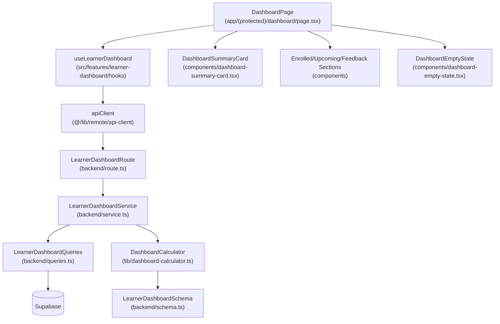

# 개요
- LearnerDashboardSchema (`src/features/learner-dashboard/backend/schema.ts`): 학습자 대시보드 응답을 명세하는 zod 스키마를 정비하고 DTO를 일관되게 노출합니다.
- LearnerDashboardQueries (`src/features/learner-dashboard/backend/queries.ts`): Supabase에서 수강 정보, 과제, 제출, 피드백을 가져오는 쿼리 래퍼를 모듈화합니다.
- DashboardCalculator (`src/features/learner-dashboard/lib/dashboard-calculator.ts`): 가중치 기반 총점, 지각/재제출 상태, 통계치를 계산하는 순수 함수를 제공합니다.
- LearnerDashboardService (`src/features/learner-dashboard/backend/service.ts`): 쿼리와 계산 모듈을 조합해 스펙에 맞는 응답을 조립하고 에러를 래핑합니다.
- LearnerDashboardRoute (`src/features/learner-dashboard/backend/route.ts`): Hono 라우트를 유지하며 토큰 검증과 서비스 호출 흐름을 명확히 합니다.
- LearnerDashboardHook (`src/features/learner-dashboard/hooks/useLearnerDashboard.ts`): React Query 훅을 통해 API를 호출하고 실패/빈 상태 재시도 옵션을 제어합니다.
- DashboardSummaryCard (`src/features/learner-dashboard/components/dashboard-summary-card.tsx`): 총점, 진행도, 주요 경고 배지를 시각화하는 상단 요약 컴포넌트입니다.
- DashboardEmptyState (`src/features/learner-dashboard/components/dashboard-empty-state.tsx`): 등록 강의나 피드백이 없을 때 사용할 공통 빈 상태 컴포넌트입니다.
- DashboardPage (`src/app/(protected)/dashboard/page.tsx`): 요약 카드, 수강 코스, 예정 과제, 최근 피드백 섹션을 조립하고 오류/권한 분기를 처리합니다.
- Presentation QA Sheet (`docs/007/dashboard-qa.md`): 주요 UI 흐름(로딩, 빈 상태, 에러, 지각/재제출 배지)을 검증할 QA 체크리스트입니다.
- Vitest Setup (`vitest.config.ts`, `package.json`): 대시보드 계산 로직을 검증할 수 있도록 테스트 러너와 npm 스크립트를 추가합니다.

# Diagram

# Implementation Plan
- **LearnerDashboardSchema (`src/features/learner-dashboard/backend/schema.ts`)**
  - 작업: 대시보드 응답을 `summary`, `enrolledCourses`, `upcomingAssignments`, `recentFeedback`로 구조화하고, 총점/지각/재제출 속성 타입을 명시합니다.
  - 테스트: `DashboardCalculator` 유닛 테스트에서 스키마 파싱을 통과하는 데이터 샘플을 함께 검증합니다.
- **LearnerDashboardQueries (`src/features/learner-dashboard/backend/queries.ts`)**
  - 작업: 수강 정보, 예정 과제, 최근 피드백, 제출 통계를 각각 조회하는 함수로 분리하고 Supabase 에러를 도메인 에러로 매핑합니다.
  - 테스트: 서비스 유닛 테스트에서 쿼리 함수를 mock 처리해 예외/빈 데이터 분기를 검증합니다.
- **DashboardCalculator (`src/features/learner-dashboard/lib/dashboard-calculator.ts`)**
  - 작업: 가중치 합 검증, late/resubmission 상태 계산, 총점 산출, 피드백 미리보기 절단 로직을 구현합니다.
  - 테스트: `src/features/learner-dashboard/lib/__tests__/dashboard-calculator.test.ts`에 Vitest로 정상/가중치 부족/지각/재제출 케이스를 커버합니다.
- **LearnerDashboardService (`src/features/learner-dashboard/backend/service.ts`)**
  - 작업: 쿼리 결과를 조합해 스키마에 맞는 응답을 반환하고, 빈 강의/누락 점수/401 에러 등 비즈니스 룰을 적용합니다.
  - 테스트: `src/features/learner-dashboard/backend/__tests__/service.test.ts`에서 쿼리 모듈을 mock 하여 성공, 빈 데이터, 에러 흐름을 검증합니다.
- **LearnerDashboardRoute (`src/features/learner-dashboard/backend/route.ts`)**
  - 작업: 토큰 검증, 학습자 권한 체크, 서비스 호출 실패 시 로거 호출 여부를 정리합니다.
  - 테스트: 서비스 유닛 테스트로 간접 커버되며, 라우트는 Hono 테스트 헬퍼로 401/403/200 응답만 스폿 체크합니다.
- **LearnerDashboardHook (`src/features/learner-dashboard/hooks/useLearnerDashboard.ts`)**
  - 작업: `retry: 1`, `refetchOnWindowFocus: false` 옵션을 지정하고 `select`로 빈 배열 기본값을 제공하며 오류 메시지를 노출할 수 있게 합니다.
  - QA: QA 시트에서 네트워크 실패 후 재시도 버튼이 refetch를 트리거하는지 확인합니다.
- **DashboardSummaryCard (`src/features/learner-dashboard/components/dashboard-summary-card.tsx`)**
  - 작업: 총점, 진행률, 지각/재제출 경고 배지, 피드백 미리보기를 카드 레이아웃으로 표시하고 date-fns로 마감 기한을 포맷합니다.
  - QA: `docs/007/dashboard-qa.md`에 표준/지각/점수 누락/빈 상태 시각적 확인 항목을 추가합니다.
- **DashboardEmptyState (`src/features/learner-dashboard/components/dashboard-empty-state.tsx`)**
  - 작업: 아이콘, 설명, CTA 버튼을 받아 상황별 빈 화면을 재사용 가능하게 구성합니다.
  - QA: QA 시트에 강의/피드백 데이터가 없을 때 올바른 메시지가 노출되는지 체크합니다.
- **DashboardPage (`src/app/(protected)/dashboard/page.tsx`)**
  - 작업: 요약 카드와 섹션 컴포넌트를 조립하고, 학습자/강사 권한 분기, 로딩/에러/빈 상태 UI 처리를 명확히 합니다.
  - QA: QA 시트에 로딩 스피너, 에러 토스트, 강사 리다이렉션, 빈 상태 CG를 포함합니다.
- **Presentation QA Sheet (`docs/007/dashboard-qa.md`)**
  - 작업: 주요 사용자 시나리오(정상, 빈, 지각, 세션 만료, 재시도)를 표 형태로 정리합니다.
  - QA: 문서 자체가 QA 기준이므로 프론트 배포 전 체크리스트로 사용합니다.
- **Vitest Setup (`vitest.config.ts`, `package.json`)**
  - 작업: `vitest`, `@testing-library/react`(필요 시) 등을 devDependencies에 추가하고, `npm run test` 스크립트와 경로 alias(`@/`)를 설정합니다.
  - 테스트: CI 대체로 로컬 `npm run test`가 통과하는지 확인합니다.
