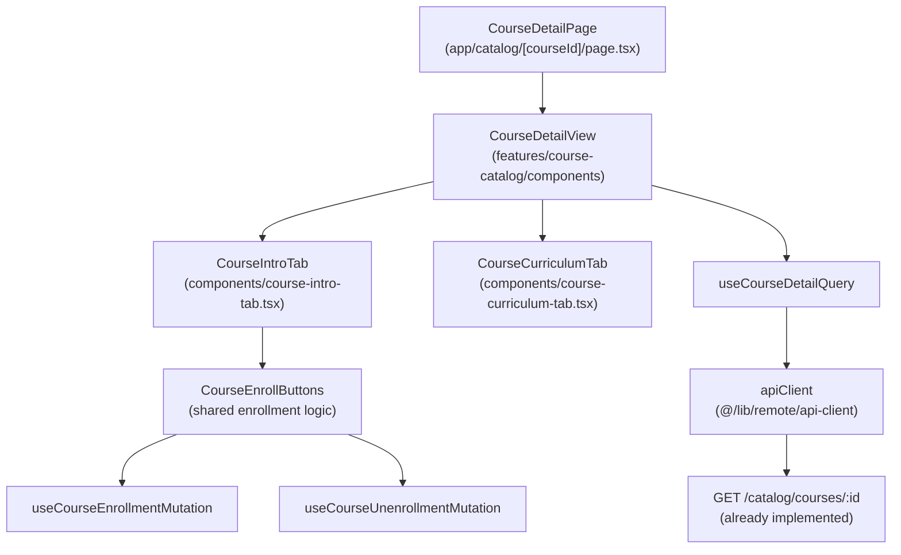

# 개요
- **CourseDetailPage** (`src/app/catalog/[courseId]/page.tsx`): 코스 상세 전용 페이지를 렌더링하고 탭 UI를 제공합니다.
- **CourseDetailView** (`src/features/course-catalog/components/course-detail-view.tsx`): 코스 상세 정보를 표시하는 메인 컴포넌트로, 기존 `CourseDetailDialog`의 로직을 재사용합니다.
- **CourseIntroTab** (`src/features/course-catalog/components/course-intro-tab.tsx`): 소개 탭 컨텐츠(설명, 강사 정보, 수강생 수, 평균 평점, 수강신청 버튼)를 렌더링합니다.
- **CourseCurriculumTab** (`src/features/course-catalog/components/course-curriculum-tab.tsx`): 커리큘럼 탭 컨텐츠(과제 목록)를 렌더링합니다(선택적 구현).
- **useCourseDetailQuery** (`src/features/course-catalog/hooks/useCourseDetailQuery.ts`): 기존 훅을 재사용하여 코스 상세 정보를 조회합니다.
- **Shared Components**: 기존 `CourseDetailDialog`의 수강신청/취소 로직을 공통 컴포넌트로 분리하여 재사용합니다.

# Diagram

# Implementation Plan
- **CourseDetailPage (`src/app/catalog/[courseId]/page.tsx`)**
  - 작업: `params`를 `Promise<{ courseId: string }>`로 받아 `await` 후 `CourseDetailView`에 전달합니다.
  - 작업: 헤더와 푸터는 기존 카탈로그 페이지와 동일한 레이아웃을 사용합니다.
  - 작업: 로딩/에러 상태는 `CourseDetailView` 내부에서 처리합니다.
  - QA: `docs/008/course-detail-qa.md`에 페이지 접근, 라우팅, 뒤로가기 동작을 포함합니다.
- **CourseDetailView (`src/features/course-catalog/components/course-detail-view.tsx`)**
  - 작업: `useCourseDetailQuery`로 코스 정보를 조회하고 탭 UI(`@/components/ui/tabs`)를 렌더링합니다.
  - 작업: 기본 탭은 "소개"이며, "커리큘럼" 탭은 선택적으로 표시합니다.
  - 작업: 로딩 시 스켈레톤, 에러 시 에러 메시지와 재시도 버튼, 404 시 "코스를 찾을 수 없습니다" 안내를 표시합니다.
  - QA: QA 시트에 로딩, 에러, 404, 탭 전환 시나리오를 추가합니다.
- **CourseIntroTab (`src/features/course-catalog/components/course-intro-tab.tsx`)**
  - 작업: 코스 썸네일, 제목, 설명, 카테고리/난이도 배지, 강사명, 수강생 수, 평균 평점(모의)을 렌더링합니다.
  - 작업: `CourseEnrollButtons` 컴포넌트를 하단에 배치합니다.
  - 작업: 기존 `CourseDetailDialog`의 레이아웃을 참고하되, Sheet가 아닌 full page 레이아웃에 맞게 조정합니다.
  - QA: QA 시트에 정보 표시, 반응형 레이아웃, 이미지 로드 실패 처리를 포함합니다.
- **CourseCurriculumTab (`src/features/course-catalog/components/course-curriculum-tab.tsx`)**
  - 작업: 코스에 포함된 과제 목록을 표시합니다(선택적 구현, 최소 구현 시 "준비 중" 메시지).
  - 작업: 과제가 없는 경우 빈 상태 일러스트와 안내 메시지를 표시합니다.
  - QA: QA 시트에 빈 상태, 과제 목록 표시를 포함합니다.
- **CourseEnrollButtons (`src/features/course-catalog/components/course-enroll-buttons.tsx`)**
  - 작업: 기존 `CourseDetailDialog`의 수강신청/취소 버튼 로직을 분리하여 공통 컴포넌트로 만듭니다.
  - 작업: 로그인 여부, 학습자/강사 역할, 수강 등록 여부에 따라 버튼 상태를 제어합니다.
  - 작업: `useCourseEnrollmentMutation`, `useCourseUnenrollmentMutation` 훅을 사용합니다.
  - QA: QA 시트에 로그인 안내, 강사 차단, 수강신청/취소 성공/실패 시나리오를 포함합니다.
- **Shared Components Integration**
  - 작업: `CourseDetailDialog`가 `CourseEnrollButtons`를 재사용하도록 리팩토링하여 코드 중복을 제거합니다.
  - 테스트: 기존 카탈로그 페이지의 Sheet 동작이 정상적으로 유지되는지 확인합니다.
- **Presentation QA Sheet (`docs/008/course-detail-qa.md`)**
  - 작업: 주요 사용자 시나리오(정상 조회, 로그인/비로그인, 수강신청, 탭 전환, 404)를 표 형태로 정리합니다.
  - QA: 문서 자체가 QA 기준이므로 프론트 배포 전 체크리스트로 사용합니다.
