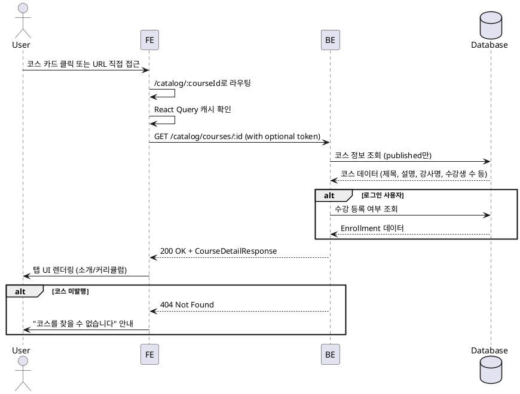

# 8번 기능 – 코스 상세 전용 페이지

## Use Case
- **Primary Actor**: 일반 사용자(로그인 여부 무관), 학습자, 강사
- **Precondition (사용자 관점)**:
  - 사용자가 코스 카탈로그 또는 직접 URL로 특정 코스 상세 페이지에 접근할 수 있다.
  - 코스가 `published` 상태여야 조회 가능하다.
- **Trigger**: 사용자가 코스 카탈로그에서 특정 코스를 클릭하거나 `/catalog/:courseId` URL로 직접 접근한다.

## Main Scenario
1. 사용자가 코스 카탈로그에서 특정 코스 카드를 클릭한다.
2. 프런트엔드가 `/catalog/:courseId` 페이지로 라우팅한다.
3. 프런트엔드는 React Query를 통해 `GET /catalog/courses/:id` API를 호출한다(로그인 시 토큰 포함).
4. 백엔드는 코스 정보(제목, 설명, 강사명, 수강생 수, 카테고리, 난이도, 썸네일)를 조회한다.
5. 백엔드는 로그인 사용자인 경우 수강 등록 여부를 함께 조회하여 반환한다.
6. 프런트엔드는 탭 UI(소개/커리큘럼)를 렌더링하고 기본적으로 소개 탭을 표시한다.
7. 소개 탭에서는 코스 설명, 강사 정보, 수강생 수, 평균 평점(모의), 수강신청 버튼을 표시한다.
8. 커리큘럼 탭에서는 코스에 포함된 과제 목록(제목, 마감일, 배점)을 표시한다(선택적 구현).
9. 학습자가 로그인한 경우 수강신청/취소 버튼이 활성화되고, 강사는 버튼이 비활성화된다.

## Edge Cases
- 네트워크 실패 또는 5xx: 에러 메시지와 재시도 버튼을 표시한다.
- 401/403 응답: 로그인 안내 메시지를 표시하되, 코스 정보 자체는 조회 가능하다.
- 코스가 `published`가 아닌 경우: 404 페이지를 표시하고 "코스를 찾을 수 없습니다" 안내를 제공한다.
- 로그인하지 않은 사용자: 수강신청 버튼 클릭 시 로그인 페이지로 리다이렉트한다.
- 강사가 접근한 경우: 수강신청 버튼을 비활성화하고 "강사는 수강할 수 없습니다" 안내를 표시한다.
- 이미 수강 중인 학습자: "수강 중" 배지를 표시하고 수강 취소 버튼을 제공한다.
- 썸네일이 없는 경우: 기본 placeholder 이미지를 표시한다.
- 커리큘럼 탭 데이터가 없는 경우: "아직 과제가 등록되지 않았습니다" 메시지를 표시한다.

## Business Rules
- 코스 상세 페이지는 `published` 상태의 코스만 조회 가능하다.
- 로그인하지 않은 사용자도 코스 정보를 조회할 수 있으나, 수강신청은 학습자 로그인 후 가능하다.
- 강사는 자신의 코스를 포함하여 어떤 코스도 수강 신청할 수 없다.
- 학습자는 동일 코스를 중복으로 수강 신청할 수 없다.
- 수강 취소는 학습자가 이미 수강 중인 코스에서만 가능하다.
- 평균 평점은 현재 모의(mock) 데이터로 표시하며, 향후 실제 평점 기능이 추가될 수 있다.
- 수강생 수는 `enrollments` 테이블의 count 값을 실시간으로 반영한다.
- 커리큘럼 탭은 선택적 구현이며, 최소 구현은 소개 탭만 제공한다.
- 시스템 시간은 UTC 기준으로 저장되며, 사용자 로캘에 맞춰 클라이언트에서 포맷한다.

## Sequence Diagram

