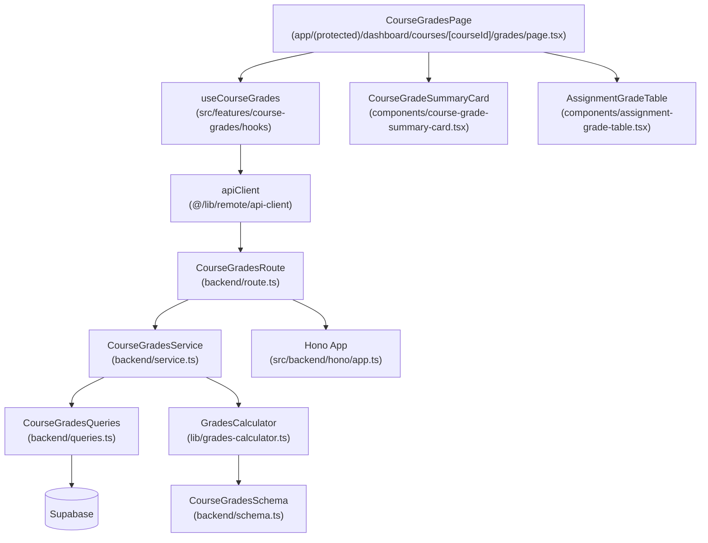

# 개요
- **CourseGradesSchema** (`src/features/course-grades/backend/schema.ts`): 코스별 성적 응답을 명세하는 zod 스키마를 정의하고 DTO를 일관되게 노출합니다.
- **CourseGradesQueries** (`src/features/course-grades/backend/queries.ts`): Supabase에서 과제 목록, 제출 이력, 점수, 가중치를 가져오는 쿼리 래퍼를 모듈화합니다.
- **GradesCalculator** (`src/features/course-grades/lib/grades-calculator.ts`): 가중치 기반 총점 계산, 부분 총점 안내, 상태별 필터링을 수행하는 순수 함수를 제공합니다.
- **CourseGradesService** (`src/features/course-grades/backend/service.ts`): 쿼리와 계산 모듈을 조합해 스펙에 맞는 응답을 조립하고 에러를 래핑합니다.
- **CourseGradesRoute** (`src/features/course-grades/backend/route.ts`): `/learner/courses/:courseId/grades` 엔드포인트를 노출하고 토큰 검증과 서비스 호출 흐름을 명확히 합니다.
- **CourseGradesHook** (`src/features/course-grades/hooks/useCourseGrades.ts`): React Query 훅을 통해 API를 호출하고 실패/빈 상태 재시도 옵션을 제어합니다.
- **CourseGradeSummaryCard** (`src/features/course-grades/components/course-grade-summary-card.tsx`): 코스 총점, 가중치 합, 채점 완료 과제 수를 시각화하는 상단 요약 컴포넌트입니다.
- **AssignmentGradeTable** (`src/features/course-grades/components/assignment-grade-table.tsx`): 과제별 점수, 가중치, 상태, 피드백을 테이블 형태로 렌더링하는 컴포넌트입니다.
- **CourseGradesPage** (`src/app/(protected)/dashboard/courses/[courseId]/grades/page.tsx`): 요약 카드와 테이블을 조립하고 오류/권한 분기를 처리합니다.
- **Hono App Registration** (`src/backend/hono/app.ts`): course-grades 라우트를 등록합니다.
- **Presentation QA Sheet** (`docs/009/grades-qa.md`): 주요 UI 흐름(로딩, 빈 상태, 에러, 총점 계산, 재제출 버튼)을 검증할 QA 체크리스트입니다.

# Diagram

# Implementation Plan
- **CourseGradesSchema (`src/features/course-grades/backend/schema.ts`)**
  - 작업: 코스 성적 응답을 `summary`(총점, 가중치 합, 채점 완료 수), `assignments`(과제별 점수, 가중치, 상태, 피드백)로 구조화하고 타입을 명시합니다.
  - 테스트: `GradesCalculator` 유닛 테스트에서 스키마 파싱을 통과하는 데이터 샘플을 함께 검증합니다.
- **CourseGradesQueries (`src/features/course-grades/backend/queries.ts`)**
  - 작업: 코스의 `published` 과제 목록, 학습자 제출 이력, 점수, 가중치를 각각 조회하는 함수로 분리하고 Supabase 에러를 도메인 에러로 매핑합니다.
  - 테스트: 서비스 유닛 테스트에서 쿼리 함수를 mock 처리해 예외/빈 데이터 분기를 검증합니다.
- **GradesCalculator (`src/features/course-grades/lib/grades-calculator.ts`)**
  - 작업: 가중치 합 검증, 채점 완료 과제 필터링, 총점 산출(`Σ(점수 × 가중치 / 100)`), 부분 총점 플래그 계산 로직을 구현합니다.
  - 테스트: `src/features/course-grades/lib/__tests__/grades-calculator.test.ts`에 Vitest로 정상/가중치 부족/일부 채점/빈 과제 케이스를 커버합니다.
- **CourseGradesService (`src/features/course-grades/backend/service.ts`)**
  - 작업: 쿼리 결과를 조합해 스키마에 맞는 응답을 반환하고, 빈 과제/누락 점수/401 에러 등 비즈니스 룰을 적용합니다.
  - 테스트: `src/features/course-grades/backend/__tests__/service.test.ts`에서 쿼리 모듈을 mock 하여 성공, 빈 데이터, 에러 흐름을 검증합니다.
- **CourseGradesRoute (`src/features/course-grades/backend/route.ts`)**
  - 작업: 토큰 검증, 학습자 권한 체크, 수강 등록 검증, 서비스 호출 실패 시 로거 호출 여부를 정리합니다.
  - 테스트: 서비스 유닛 테스트로 간접 커버되며, 라우트는 Hono 테스트 헬퍼로 401/403/200 응답만 스폿 체크합니다.
- **CourseGradesHook (`src/features/course-grades/hooks/useCourseGrades.ts`)**
  - 작업: `retry: 1`, `refetchOnWindowFocus: false` 옵션을 지정하고 `select`로 빈 배열 기본값을 제공하며 오류 메시지를 노출할 수 있게 합니다.
  - QA: QA 시트에서 네트워크 실패 후 재시도 버튼이 refetch를 트리거하는지 확인합니다.
- **CourseGradeSummaryCard (`src/features/course-grades/components/course-grade-summary-card.tsx`)**
  - 작업: 총점, 가중치 합, 채점 완료/전체 과제 수를 카드 레이아웃으로 표시하고 부분 총점 안내를 조건부 렌더링합니다.
  - QA: `docs/009/grades-qa.md`에 표준/부분 총점/빈 상태 시각적 확인 항목을 추가합니다.
- **AssignmentGradeTable (`src/features/course-grades/components/assignment-grade-table.tsx`)**
  - 작업: 과제 제목, 점수, 가중치, 상태 배지, 피드백 미리보기, 재제출 버튼을 테이블로 렌더링하고 정렬/필터 옵션을 제공합니다.
  - QA: QA 시트에 지각 배지, 재제출 버튼, 피드백 확장 기능 확인 항목을 포함합니다.
- **CourseGradesPage (`src/app/(protected)/dashboard/courses/[courseId]/grades/page.tsx`)**
  - 작업: 요약 카드와 테이블을 조립하고, 학습자/강사 권한 분기, 로딩/에러/빈 상태 UI 처리를 명확히 합니다.
  - QA: QA 시트에 로딩 스피너, 에러 토스트, 강사 리다이렉션, 빈 상태 처리를 포함합니다.
- **Hono App Registration (`src/backend/hono/app.ts`)**
  - 작업: `registerCourseGradesRoutes(app)`를 추가하고 초기화 로그를 포함합니다.
  - 테스트: 빌드 단계에서 라우트 등록 로그가 출력되는지 확인합니다.
- **Presentation QA Sheet (`docs/009/grades-qa.md`)**
  - 작업: 주요 사용자 시나리오(정상, 빈, 부분 총점, 세션 만료, 재시도)를 표 형태로 정리합니다.
  - QA: 문서 자체가 QA 기준이므로 프론트 배포 전 체크리스트로 사용합니다.
