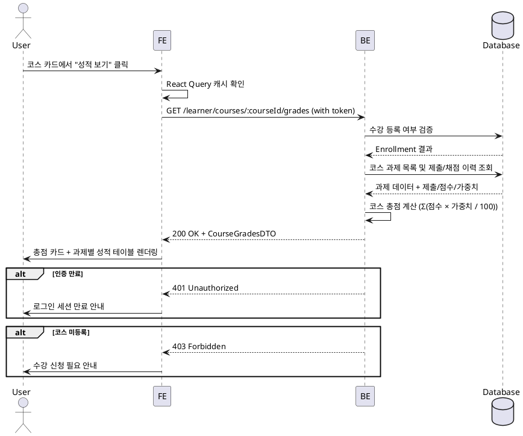

# 9번 기능 – 코스별 성적 상세 페이지

## Use Case
- **Primary Actor**: 학습자(Learner)
- **Precondition (사용자 관점)**:
  - 유효한 학습자 계정으로 로그인되어 있다.
  - 해당 코스에 수강 신청이 완료되어 있다.
  - 최소 한 개 이상의 과제가 존재하고 일부 과제를 제출한 상태다.
- **Trigger**: 학습자가 대시보드에서 수강 중인 코스를 선택하고 성적 메뉴를 클릭한다.

## Main Scenario
1. 학습자가 대시보드의 특정 코스 카드에서 "성적 보기" 버튼을 클릭한다.
2. 프런트엔드가 React Query를 통해 `GET /learner/courses/:courseId/grades` API를 호출하며 사용자 토큰을 함께 전달한다.
3. 백엔드는 토큰으로 학습자 계정을 확인한 뒤 코스 수강 등록 여부를 검증한다.
4. 백엔드는 해당 코스의 모든 `published` 과제 목록과 학습자의 제출 이력, 점수, 피드백, 가중치를 조회한다.
5. 백엔드는 과제별 점수와 가중치를 기반으로 코스 총점을 계산한다: `Σ(과제 점수 × 과제 가중치 / 100)`
6. 백엔드는 과제별 상세 정보(제목, 점수, 가중치, 지각 여부, 제출 상태, 피드백)와 코스 총점을 표준 응답 포맷으로 반환한다.
7. 프런트엔드는 수신한 데이터를 테이블 UI로 렌더링하고, 상단에 코스 총점 카드를 표시한다.
8. 학습자는 각 과제의 점수, 피드백, 제출 상태를 확인하고 필요 시 재제출 가능 여부를 파악한다.

## Edge Cases
- 네트워크 실패 또는 5xx: 에러 토스트와 재시도 버튼을 노출하고 React Query `retry`를 제한적으로 사용한다.
- 401/403 응답: 세션 만료 메시지를 띄우고 로그인 페이지로 리다이렉트한다.
- 코스 미등록 상태: 403 에러를 반환하고 프런트엔드는 수강 신청 안내 메시지를 표시한다.
- 과제가 하나도 없는 경우: 빈 상태 일러스트와 "아직 과제가 없습니다" 메시지를 보여준다.
- 일부 과제만 채점된 경우: 미채점 과제는 "평가 대기" 상태로 표시하고 총점 계산에서 제외한다.
- 가중치 합이 100이 아닌 경우: 현재 채점 완료된 과제의 가중치 합을 기준으로 부분 총점을 계산하고 안내 메시지를 노출한다.
- 지각 제출된 과제: 별도 배지로 강조 표시하고 점수에 페널티가 있는 경우 별도 표시한다.

## Business Rules
- 학습자는 본인이 수강 신청한 코스의 성적만 조회할 수 있다.
- 코스 총점은 `Σ(과제 점수 × 과제 가중치 / 100)`로 계산하며, 채점 완료된 과제만 포함한다.
- 가중치 합이 100 미만인 경우, 남은 비중은 0으로 간주하고 부분 총점임을 명시한다.
- `graded` 상태의 과제만 총점 계산에 포함되며, `submitted`, `resubmission_required` 상태는 "평가 대기"로 표시한다.
- 지각 제출(`late=true`)된 과제는 별도 배지로 표시하되, 점수 자체는 강사가 입력한 값을 그대로 사용한다.
- 피드백이 긴 경우 테이블에서는 2줄까지만 미리보기로 보여주고, 전체 내용은 확장 버튼으로 확인한다.
- 시스템 시간은 UTC 기준으로 저장되며, 사용자 로캘에 맞춰 클라이언트에서 포맷한다.
- 재제출 요청(`resubmission_required`)된 과제는 "재제출 필요" 배지와 함께 재제출 버튼을 노출한다.

## Sequence Diagram

