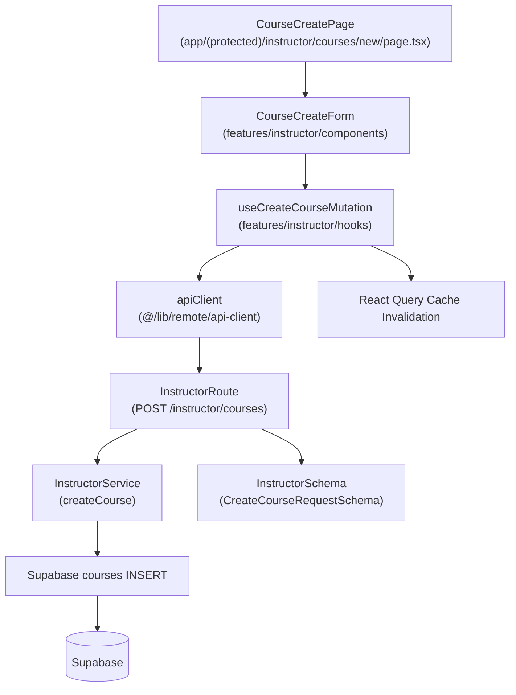

# 개요
- **InstructorSchema** (`src/features/instructor/backend/schema.ts`): `CreateCourseRequestSchema`와 `CourseResponseSchema`를 추가하여 코스 생성 요청/응답을 명세합니다.
- **InstructorService** (`src/features/instructor/backend/service.ts`): `createCourse` 함수를 추가하여 Supabase `courses` 테이블에 신규 레코드를 삽입하고 강사 권한을 검증합니다.
- **InstructorRoute** (`src/features/instructor/backend/route.ts`): `POST /instructor/courses` 엔드포인트를 추가하고 토큰 검증 및 서비스 호출을 처리합니다.
- **CourseCreateForm** (`src/features/instructor/components/course-create-form.tsx`): `react-hook-form` + `zod`를 활용한 코스 생성 폼 컴포넌트입니다.
- **CourseCreatePage** (`src/app/(protected)/instructor/courses/new/page.tsx`): 코스 생성 폼을 렌더링하고 인증/권한을 체크합니다.
- **useCreateCourseMutation** (`src/features/instructor/hooks/useCreateCourseMutation.ts`): React Query mutation 훅으로 코스 생성 API를 호출하고 캐시를 무효화합니다.
- **Presentation QA Sheet** (`docs/010/course-create-qa.md`): 폼 검증, 권한 체크, 성공/실패 흐름을 검증할 QA 체크리스트입니다.

# Diagram

# Implementation Plan
- **InstructorSchema (`src/features/instructor/backend/schema.ts`)**
  - 작업: `CreateCourseRequestSchema`를 추가하여 `title`(필수, 최소 1자), `description`(필수, 최소 1자), `category`(enum), `difficulty`(enum), `thumbnailUrl`(선택, URL 형식) 필드를 정의합니다.
  - 작업: `CourseResponseSchema`를 추가하여 생성된 코스의 `id`, `title`, `status`, `createdAt` 등을 반환합니다.
  - 테스트: Vitest로 스키마 파싱이 정상/누락 필드/잘못된 enum 케이스를 통과하는지 검증합니다.
- **InstructorService (`src/features/instructor/backend/service.ts`)**
  - 작업: `createCourse(client, instructorId, data)` 함수를 추가하여 강사 권한 검증 후 `courses` 테이블에 INSERT 쿼리를 실행합니다.
  - 작업: `instructor_id`, `status='draft'`, `created_at`, `updated_at`을 자동 설정합니다.
  - 테스트: `src/features/instructor/backend/__tests__/service.test.ts`에서 Supabase 클라이언트를 mock 하여 성공/권한 오류/DB 오류 케이스를 검증합니다.
- **InstructorRoute (`src/features/instructor/backend/route.ts`)**
  - 작업: `POST /instructor/courses` 엔드포인트를 추가하고 토큰 검증, 강사 역할 체크, 스키마 검증, 서비스 호출을 순차 처리합니다.
  - 작업: 생성 성공 시 201 Created, 권한 오류 시 403, 검증 실패 시 422를 반환합니다.
  - 테스트: Hono 테스트 헬퍼로 201/403/422 응답을 스폿 체크합니다.
- **CourseCreateForm (`src/features/instructor/components/course-create-form.tsx`)**
  - 작업: `react-hook-form` + `zodResolver`를 활용하여 `title`, `description`, `category`, `difficulty`, `thumbnailUrl` 입력 필드를 렌더링합니다.
  - 작업: 카테고리와 난이도는 `COURSE_CATEGORIES`, `COURSE_DIFFICULTIES` 상수 목록에서 Select 컴포넌트로 제공합니다.
  - 작업: 제출 시 `useCreateCourseMutation`을 호출하고 성공 시 toast와 리다이렉트를 처리합니다.
  - QA: `docs/010/course-create-qa.md`에 필수 필드 누락, URL 형식 오류, 제출 성공/실패 시나리오를 추가합니다.
- **CourseCreatePage (`src/app/(protected)/instructor/courses/new/page.tsx`)**
  - 작업: `CourseCreateForm`을 렌더링하고 학습자 접근 차단, 미인증 사용자 리다이렉트를 처리합니다.
  - 작업: `useUserProfile`로 역할을 확인하여 instructor가 아니면 403 페이지를 표시합니다.
  - QA: QA 시트에 권한 체크, 로딩 상태, 폼 렌더링을 포함합니다.
- **useCreateCourseMutation (`src/features/instructor/hooks/useCreateCourseMutation.ts`)**
  - 작업: `useMutation`으로 `POST /instructor/courses` API를 호출하고 성공 시 강사 코스 목록 캐시(`['instructor', 'courses']`)를 무효화합니다.
  - 작업: 에러 시 `extractApiErrorMessage`로 메시지를 추출하여 반환합니다.
  - 테스트: `@testing-library/react-hooks`로 mutation 성공/실패 시 캐시 무효화 여부를 검증합니다.
- **Presentation QA Sheet (`docs/010/course-create-qa.md`)**
  - 작업: 주요 사용자 시나리오(정상 생성, 필수 필드 누락, 권한 오류, 네트워크 실패)를 표 형태로 정리합니다.
  - QA: 문서 자체가 QA 기준이므로 프론트 배포 전 체크리스트로 사용합니다.
