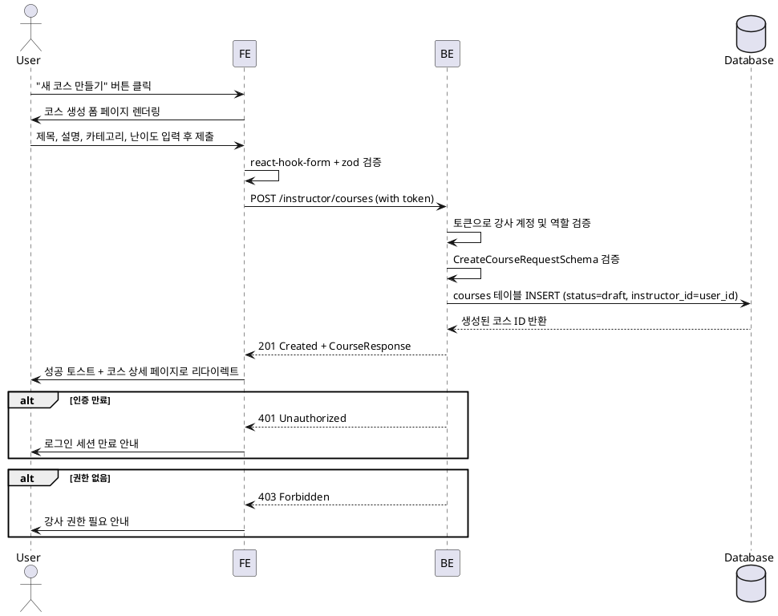

# 10번 기능 – 코스 생성 (Instructor)

## Use Case
- **Primary Actor**: 강사(Instructor)
- **Precondition (사용자 관점)**:
  - 유효한 강사 계정으로 로그인되어 있다.
  - 강사 대시보드 또는 코스 관리 페이지에 접근할 수 있다.
- **Trigger**: 강사가 "새 코스 만들기" 버튼을 클릭한다.

## Main Scenario
1. 강사가 강사 대시보드에서 "새 코스 만들기" 버튼을 클릭한다.
2. 프런트엔드가 코스 생성 폼 페이지(`/instructor/courses/new`)로 라우팅한다.
3. 강사가 필수 입력값(제목, 설명, 카테고리, 난이도)을 입력하고 선택적으로 썸네일 URL을 입력한다.
4. 프런트엔드는 `react-hook-form` + `zod`를 통해 입력값을 검증한다.
5. 검증이 통과되면 프런트엔드는 `@/lib/remote/api-client`를 통해 `POST /instructor/courses` API를 호출하며 사용자 토큰을 함께 전달한다.
6. 백엔드는 토큰으로 강사 계정을 확인한 뒤 역할을 검증한다.
7. 백엔드는 요청 본문을 `CreateCourseRequestSchema`로 검증하고 `courses` 테이블에 신규 레코드를 삽입한다.
8. 백엔드는 생성된 코스의 초기 상태를 `draft`로 설정하고 `instructor_id`를 토큰의 사용자 ID로 지정한다.
9. 백엔드는 생성된 코스 정보(id, title, status 등)를 표준 응답 포맷으로 반환한다.
10. 프런트엔드는 성공 토스트를 표시하고 생성된 코스의 상세 페이지(`/instructor/courses/:courseId`)로 리다이렉트한다.

## Edge Cases
- 네트워크 실패 또는 5xx: 에러 토스트와 재시도 안내를 표시하고 폼 상태를 유지한다.
- 401/403 응답: 세션 만료 메시지를 띄우고 로그인 페이지로 리다이렉트한다.
- 필수 필드 누락: 프런트엔드 검증 단계에서 해당 필드에 에러 메시지를 표시하고 제출을 차단한다.
- 제목 중복(선택적 검증): 백엔드에서 409 에러를 반환하면 프런트엔드는 "이미 같은 제목의 코스가 있습니다" 메시지를 표시한다.
- 잘못된 카테고리/난이도 값: 백엔드 스키마 검증에서 400 에러를 반환하고 프런트엔드는 유효한 값 목록을 안내한다.
- 썸네일 URL 형식 오류: 프런트엔드 검증에서 URL 형식을 체크하고, 비워둔 경우 기본 placeholder를 사용한다.

## Business Rules
- 코스는 반드시 `instructor` 역할을 가진 사용자만 생성할 수 있다.
- 생성 시 초기 상태는 `draft`이며, 강사가 명시적으로 `published`로 전환하기 전까지 학습자에게 노출되지 않는다.
- 제목과 설명은 필수 입력값이며, 각각 최소 1자 이상이어야 한다.
- 카테고리와 난이도는 사전 정의된 상수 목록(`COURSE_CATEGORIES`, `COURSE_DIFFICULTIES`)에서 선택해야 한다.
- 썸네일 URL은 선택 입력이며, 제공하지 않으면 `null`로 저장되고 프런트엔드에서 기본 이미지를 표시한다.
- 생성된 코스의 `instructor_id`는 토큰의 사용자 ID와 동일해야 하며, 다른 사용자로 코스를 생성할 수 없다.
- `created_at`과 `updated_at`은 자동으로 현재 시각(UTC)으로 설정된다.
- 생성 후 바로 과제를 추가하거나 상태를 변경할 수 있도록 코스 상세 페이지로 이동한다.

## Sequence Diagram

